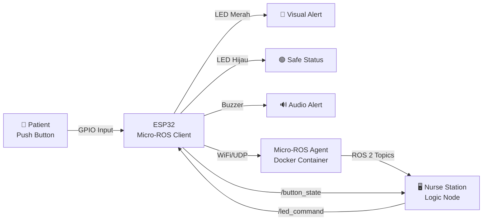

<div align="center">
  
  
  # 🏥 Smart Nurse Call System
  ### *Revolutionizing Healthcare Communication with Micro-ROS & IoT*
  
  
  
  
  
  
  <p align="center">
    <a href="#-fitur-unggulan">Fitur</a> •
    <a href="#-komponen-sistem">Komponen</a> •
    <a href="#-arsitektur">Arsitektur</a> •
    <a href="#%EF%B8%8F-instalasi">Instalasi</a> •
    <a href="#-dokumentasi">Dokumentasi</a>
  </p>
</div>

---

## 👥 Tim Pengembang

<table align="center">
  <tr>
    <td align="center"><b>🧑‍💻 Andronikus Parasian Siagian</b><br/>122430095</td>
    <td align="center"><b>🧑‍💻 M. Aulia Bahtiar</b><br/>122430062</td>
    <td align="center"><b>🧑‍💻 Saif Khan Nazirun</b><br/>122430060</td>
  </tr>
</table>

---

## 💡 Tentang Proyek

> **Smart Nurse Call System** adalah sistem panggilan perawat cerdas berbasis **Micro-ROS** yang mengintegrasikan mikrokontroler **ESP32** dengan **ROS 2 (Robot Operating System 2)** untuk menciptakan komunikasi real-time antara pasien dan tenaga medis. Sistem ini memanfaatkan teknologi **IoT (Internet of Things)** dan arsitektur **Publisher-Subscriber** untuk menghadirkan respons yang cepat, akurat, dan efisien dalam lingkungan rumah sakit modern.

<div align="center">
  
  ### 🎯 Mengapa Proyek Ini Penting?
  
</div>

Dalam ekosistem **Smart Hospital**, kecepatan respons tenaga medis adalah faktor vital dalam keselamatan pasien. Sistem konvensional berbasis analog memiliki keterbatasan dalam skalabilitas, integrasi data, dan fleksibilitas. **Smart Nurse Call System** hadir sebagai solusi modern yang:

✅ **Wireless & Scalable** - Komunikasi nirkabel via WiFi tanpa batasan kabel  
✅ **Real-time Communication** - Latensi rendah menggunakan protokol XRCE-DDS  
✅ **ROS 2 Integration** - Mudah dikembangkan menjadi robot asisten medis otonom  
✅ **Open Architecture** - Platform terbuka untuk riset dan pengembangan lanjutan  

---

## ✨ Fitur Unggulan

<table>
  <tr>
    <td align="center" width="50%">
      <h3>🚨 Emergency Alert System</h3>
      <p>Tombol darurat yang memicu alarm visual (LED merah) dan audio (buzzer) secara simultan untuk respons cepat</p>
    </td>
    <td align="center" width="50%">
      <h3>🔄 Real-time Monitoring</h3>
      <p>Data status pasien dikirim real-time ke Nurse Station menggunakan protokol XRCE-DDS</p>
    </td>
  </tr>
  <tr>
    <td align="center">
      <h3>📡 Wireless Communication</h3>
      <p>Koneksi WiFi antara ESP32 dan server dengan dukungan jaringan lokal dan cloud</p>
    </td>
    <td align="center">
      <h3>🤖 ROS 2 Integration</h3>
      <p>Arsitektur berbasis ROS 2 untuk ekspansi ke sistem robotik medis otonom</p>
    </td>
  </tr>
</table>

---

## 🧠 Arsitektur Sistem

<div align="center">
  


</div>

### 📋 Alur Kerja Sistem

1. **Input Pasien** → Pasien menekan tombol darurat fisik
2. **Processing ESP32** → ESP32 membaca status GPIO dan mem-publish data ke topic `/button_state`
3. **Network Transport** → Data dikirim via WiFi menggunakan protokol XRCE-DDS
4. **ROS 2 Agent** → Micro-ROS Agent menerima dan meneruskan data ke ROS 2 ecosystem
5. **Logic Processing** → Python node (`nurse_bot.py`) memproses logika dan mem-publish ke `/led_command`
6. **Actuator Response** → ESP32 subscribe ke `/led_command` dan mengaktifkan LED + Buzzer

---

## 🎯 Tujuan & Manfaat

### 🎓 Tujuan Pembelajaran
- ✅ Implementasi **Micro-ROS** pada sistem embedded
- ✅ Penerapan **Publisher-Subscriber Pattern** ROS 2
- ✅ Integrasi **ESP32** dengan middleware robotik
- ✅ Pengembangan **IoT Medical Device** berbasis open-source

### 🏥 Manfaat Praktis
- 💡 Meningkatkan kecepatan respons tenaga medis terhadap panggilan pasien
- 💡 Sistem scalable yang dapat diintegrasikan dengan robot medis otonom
- 💡 Platform pembelajaran untuk riset Robotika Medis
- 💡 Monitoring terpusat dengan log real-time untuk evaluasi layanan

---

## 🛠️ Komponen Sistem

<details open>
<summary><b>🔧 Hardware Components</b></summary>

| Komponen | Spesifikasi | Jumlah | Fungsi |
|----------|-------------|--------|--------|
| **ESP32 DOIT DEVKIT V1** | Dual-core 240MHz, WiFi/BT | 1 | Mikrokontroler utama & komunikasi nirkabel |
| **Push Button** | Tactile Switch 6x6mm | 1 | Input darurat dari pasien |
| **LED Merah** | 5mm, 20mA | 1 | Indikator status bahaya/panggilan aktif |
| **LED Hijau** | 5mm, 20mA | 1 | Indikator status aman/standby |
| **Resistor 330Ω** | 1/4W Carbon Film | 2 | Pembatas arus untuk LED |
| **Active Buzzer** | 5V DC | 1 | Alarm audio untuk notifikasi |
| **Breadboard** | 830 lubang | 1 | Platform perakitan sementara |
| **Kabel Jumper** | Male-to-Male | Secukupnya | Koneksi antar komponen |
| **Kabel Micro USB** | Data + Power | 1 | Power supply & programming |

</details>

<details open>
<summary><b>💻 Software Stack</b></summary>

| Kategori | Tools | Versi | Keterangan |
|----------|-------|-------|------------|
| **OS Host** | Windows 11 + WSL 2 | - | Sistem operasi utama |
| **OS Guest** | Ubuntu | 24.04 LTS | Subsistem Linux untuk ROS 2 |
| **Middleware** | ROS 2 Jazzy Jalisco | Latest | Robot Operating System |
| **Micro-ROS** | micro-ros-agent | Jazzy | Bridge ESP32 ↔ ROS 2 |
| **Containerization** | Docker Desktop | Latest | Menjalankan Micro-ROS Agent |
| **IDE** | Arduino IDE | 2.0+ | Pemrograman ESP32 |
| **Language** | Python | 3.10+ | Logic node & automation |
| **Web Stack** | HTML/CSS/JS | - | Dashboard monitoring (opsional) |

</details>

---

## � Instalasi & Setup

<div align="center">
  
  **Ikuti langkah-langkah berikut secara berurutan untuk membangun sistem dari awal**
  
</div>

---

## 📦 TAHAP 1: Environment Setup

<div align="center">
  
  
  
</div>

Sistem operasi utama yang digunakan adalah Windows 11 dengan subsistem Linux (WSL 2) yang menjalankan Ubuntu 24.04.

### 1.1. Instalasi WSL 2 (Ubuntu 24.04) 
- Buka PowerShell sebagai Administrator. 
- Jalankan perintah instalasi:
```bash
wsl --install -d Ubuntu-24.04
```
- Restart komputer jika diminta. 
- Buka aplikasi "Ubuntu" dari Start Menu, lalu buat username dan password UNIX baru. 

### 1.2. Instalasi ROS 2 Jazzy Jalisco

Masuk ke terminal Ubuntu, lalu jalankan perintah berikut baris per baris:

#### Set Locale:
```bash
locale # Pastikan UTF-8
sudo apt update && sudo apt install locales 
sudo locale-gen en_US.UTF-8 
sudo update-locale LC_ALL=en_US.UTF-8 LANG=en_US.UTF-8 
export LANG=en_US.UTF-8
```

#### Tambahkan Repository ROS 2:
```bash
sudo apt install software-properties-common
sudo add-apt-repository universe 
sudo apt update && sudo apt install curl -y 
sudo curl -sSL https://raw.githubusercontent.com/ros/rosdistro/master/ros.key -o /usr/share/keyrings/ros-archive-keyring.gpg 
echo "deb [arch=$(dpkg --print-architecture) signed-by=/usr/share/keyrings/ros-archive-keyring.gpg] http://packages.ros.org/ros2/ubuntu $(. /etc/os-release && echo $UBUNTU_CODENAME) main" | sudo tee /etc/apt/sources.list.d/ros2.list > /dev/null 
```

#### Install Paket ROS 2 (Desktop):
```bash
sudo apt update
sudo apt upgrade 
sudo apt install ros-jazzy-desktop
```

#### Setup Environment:

Agar perintah ROS dikenali setiap terminal dibuka:
```bash
echo "source /opt/ros/jazzy/setup.bash" >> ~/.bashrc
source ~/.bashrc 
```

### 1.3. Instalasi Docker & Micro-ROS Agent

Micro-ROS Agent dijalankan menggunakan Docker agar lebih stabil. 
- Install Docker di Windows: Unduh dan install Docker Desktop for Windows. 
- Pull Image Micro-ROS: Buka terminal Ubuntu, tarik image versi Jazzy: 
```bash
sudo docker pull microros/micro-ros-agent:jazzy 
```

---

## 🌐 TAHAP 2: Konfigurasi Jaringan & Keamanan

> **⚠️ PENTING:** Tahap ini krusial agar ESP32 bisa berkomunikasi dengan Laptop melalui WiFi!

### 2.1. Mengaktifkan WSL Mirrored Mode

Agar IP Ubuntu sama dengan IP Windows (sehingga terbaca ESP32). 
- Di Windows, buka File Explorer. 
- Ketik %UserProfile% di address bar. 
- Buat file baru bernama .wslconfig (pastikan tidak ada ekstensi .txt). 
- Isi file dengan konfigurasi berikut: 
```ini
[wsl2] 
networkingMode=mirrored 
dnsTunneling=true 
firewall=true 
autoProxy=true 
```
- Restart WSL via PowerShell: `wsl --shutdown`

### 2.2. Membuka Firewall Windows

Membuka Port 8888 (UDP) agar data ESP32 tidak diblokir. 
- Buka PowerShell (Run as Administrator). 
- Jalankan perintah: 
```powershell
New-NetFirewallRule -DisplayName "MicroROS Agent" -Direction Inbound -LocalPort 8888 -Protocol UDP -Action Allow 
```
 
---

## ⚡ TAHAP 3: Perakitan Hardware

<div align="center">
  
  ### 🔌 Wiring Diagram
  
  *Rangkaian elektronik ESP32 dengan komponen I/O*
  
</div>

### 3.1. Alat dan Bahan (Komponen Sistem)

Sistem ini terdiri dari perangkat keras (hardware) di sisi pasien dan perangkat lunak (software) di sisi server. 

A. Perangkat Keras (Hardware): 
- ESP32 DOIT DEVKIT V1: Mikrokontroler utama yang berfungsi sebagai pemroses data dan modul komunikasi WiFi. 
- Push Button (Tactile Switch): Sensor input manual untuk memicu sinyal darurat. 
- LED Merah (5mm): Indikator visual untuk status bahaya/panggilan aktif. 
- LED Hijau (5mm): Indikator visual untuk status aman/standby. 
- Resistor 330 Ohm (2 buah): Komponen penghambat arus listrik yang wajib dipasang pada kaki LED agar LED tidak kelebihan tegangan dan terbakar (putus). 
- Active Buzzer (5V): Aktuator suara untuk memberikan notifikasi alarm. 
- Breadboard & Kabel Jumper: Media perakitan rangkaian non-permanen. 
- Kabel Micro USB: Untuk catu daya dan unggah program. 
- Laptop: Sebagai Nurse Station (Server). 

**B. Perangkat Lunak (Software):**
- Sistem Operasi: Windows 11 (Host) & Ubuntu 24.04 (WSL). 
- Robot Operating System: ROS 2 Jazzy Jalisco. 
- Middleware: Micro-ROS Agent (via Docker). 
- IDE: Arduino IDE (v2.x) & VS Code (Optional). 

### 3.2. Skema Koneksi Pin

<div align="center">

> **⚠️ WAJIB:** Pasang resistor 330Ω **secara seri** dengan LED untuk mencegah kerusakan!

</div> 

| Komponen | Kaki Komponen | Pin ESP32 | Keterangan Sambungan | 
|----------|---------------|-----------|----------------------|
| Push Button |Kaki 1 | GPIO 16 (RX2) | Mode INPUT_PULLUP |
| | Kaki 2 | GND | - | 
| LED Merah | Kaki Positif (Anoda) | GPIO 23 | - | 
| | Kaki Negatif (Katoda) | GND | Lewat Resistor 330Ω (Seri) | 
| LED Hijau | Kaki Positif (Anoda) | GPIO 22 | - | 
| | Kaki Negatif (Katoda) | GND | Lewat Resistor 330Ω (Seri) 
| Buzzer | Kaki Positif (+) | GPIO 25 | - |
| | Kaki Negatif (-) | GND | Langsung ke Ground |

---

## 💾 TAHAP 4: Pemrograman Firmware ESP32

<div align="center">
  
  
</div>

### 4.1. Setup Arduino IDE 
- Install Arduino IDE 2.0+. 
- Install Board ESP32: 
  - File -> Preferences -> Additional Board Manager URLs: https://raw.githubusercontent.com/espressif/arduino-esp32/gh-pages/package_esp32_index.json 
  - Tools -> Board -> Board Manager -> Cari "esp32" by Espressif Systems -> Install. 
- Install Library Micro-ROS: 
  - Download library .zip dari GitHub micro_ros_arduino.
  - Sketch -> Include Library -> Add .ZIP Library. 

### 4.2. Upload Kode Program 
- Salin kode lengkap (robotika_medis.ino) ke Arduino IDE. 
- PENTING: Edit bagian konfigurasi jaringan sesuai kondisi saat ini: 
```cpp
char ssid[] = "NamaWiFiAnda"; 
char password[] = "PasswordWiFiAnda"; 
char agent_ip[] = "192.168.x.x"; // Cek pakai 'ip a' di Ubuntu 
```
- Hubungkan ESP32 via USB. 
- Pilih Board: DOIT ESP32 DEVKIT V1. 
- Klik Upload. 

---

## 🧪 TAHAP 5: Testing & Debugging

<div align="center">
  
  **🔍 Pengujian Manual dengan ROS 2 CLI**
  
  *Validasi komunikasi ESP32 ↔ ROS 2 sebelum implementasi otomatisasi*
  
</div>

### 5.1. Persiapan Terminal 
Buka terminal baru di Ubuntu (pastikan Agent Micro-ROS sudah berjalan di terminal lain). Masuk ke lingkungan ROS 2: 
```bash
sudo docker run -it --rm --net=host ros:jazzy 
```

### 5.2. Pengujian Input (Monitoring Tombol) 
Langkah ini bertujuan memverifikasi apakah data dari ESP32 masuk ke Laptop. 
- Jalankan perintah echo (mendengar): 
```bash
ros2 topic echo /button_state --no-daemon 
```
- Aksi: Tekan dan tahan tombol fisik di ESP32. 
- Hasil: Terminal menampilkan data: true. Saat dilepas, menampilkan data: false. 

### 5.3. Pengujian Output (Kendali Lampu) 
Langkah ini bertujuan memverifikasi apakah Laptop bisa memerintah ESP32. 
- Nyalakan Alarm (Simulasi Bahaya): 
```bash
ros2 topic pub --once /led_command std_msgs/msg/Bool "{data: true}" 
```
Hasil: LED Merah menyala dan Buzzer berbunyi. 
- Matikan Alarm (Simulasi Aman): 
```bash
ros2 topic pub --once /led_command std_msgs/msg/Bool "{data: false}" 
```
Hasil: LED Merah mati dan LED Hijau menyala. 

---

## 🧠 TAHAP 6: Implementasi Logic Node

<div align="center">
  
  **🐍 Python Automation Node**
  
  *Membuat "Otak Sistem" untuk respons otomatis tanpa manual command*
  
</div>

Setelah pengujian manual berhasil, tahap terakhir adalah membuat "Otak" (Node) menggunakan Python agar sistem dapat merespons secara otomatis tanpa perlu mengetik perintah manual.

- Buka terminal Ubuntu dan buat file script Python:
```bash
nano nurse_bot.py
```
- Masukkan kode program berikut: 
```python
import rclpy 
from rclpy.node import Node 
from std_msgs.msg import Bool 

class NurseBot(Node): 
    def __init__(self): 
        super().__init__('nurse_bot') 
        # Publisher: Mengirim perintah ke Lampu/Buzzer 
        self.publisher_ = self.create_publisher(Bool, '/led_command', 10) 
        # Subscriber: Menerima data dari Tombol 
        self.subscription = self.create_subscription(Bool, '/button_state', self.callback, 10) 
        self.get_logger().info("SISTEM NURSE CALL AKTIF... Menunggu Panggilan.") 

    def callback(self, msg): 
        # Logika Sederhana: Input = Output 
        # Jika Tombol True (Ditekan) -> Kirim Perintah True (Nyala) 
        cmd = Bool() 
        cmd.data = msg.data 
        self.publisher_.publish(cmd) 

        # Tampilkan Log 
        if msg.data: 
            self.get_logger().warn("🚨 DARURAT! Pasien Memanggil Bantuan!") 
        else: 
            self.get_logger().info("✅ AMAN. Tombol Dilepas.") 

def main(args=None): 
    rclpy.init(args=args) 
    node = NurseBot() 
    rclpy.spin(node) # Loop agar program tidak berhenti 
    rclpy.shutdown() 

if __name__ == '__main__': 
    main() 
```
- Simpan file (Ctrl+X, Y, Enter). 
- Jalankan sistem otomatisasi: 
```bash
python3 nurse_bot.py 
```
Hasil: Sekarang saat tombol ditekan, alarm akan menyala secara otomatis. 

---

## ▶️ TAHAP 7: Running the System

<div align="center">
  
  **🎬 Startup Sequence**
  
  *Urutan menjalankan sistem secara lengkap*
  
</div>

Berikut adalah urutan menyalakan sistem agar berhasil:

**1. Jalankan Agent (Di Terminal 1):**
```bash
sudo docker run -it --rm --net=host microros/micro-ros-agent:jazzy udp4 --port 8888 -v6
```

**2. Nyalakan ESP32:** 

Tekan tombol RESET (EN) di ESP32. Pastikan di Terminal 1 muncul: `Session established`

**3. Jalankan Otak/Bot (Di Terminal 2):**

```bash
python3 nurse_bot.py 
```

**4. Demonstrasi:**
- **Tekan Tombol Fisik** → Lampu Merah Nyala & Terminal Laptop muncul peringatan "🚨 DARURAT!"
- **Lepas Tombol** → Lampu Hijau Nyala & Status kembali aman

---

## � Troubleshooting & Problem Solving

<div align="center">
  
  **⚠️ Kendala yang Sering Ditemui & Solusinya**
  
  *Dokumentasi lengkap error handling selama development*
  
</div>

> Selama pengembangan sistem, tim menghadapi berbagai kendala teknis terkait kompilasi firmware, konfigurasi jaringan, dan integrasi Micro-ROS dengan ROS 2 Agent. Berikut adalah dokumentasi lengkap beserta solusinya: 
| No | Jenis Kendala | Deskripsi & Penyebab Masalah | Solusi (Troubleshooting) |
|----|---------------|-----------------------------|---------------------------|
| 1 | Error Kompilasi Arduino | Pesan error: `invalid conversion from 'const char*' to 'char*'`. Penyebabnya adalah ketidakcocokan tipe data pada library `micro_ros_arduino`, di mana konfigurasi jaringan membutuhkan tipe `char*`, sementara SSID dan password dideklarasikan sebagai `const char*`. | Mengubah deklarasi variabel SSID dan password menjadi array karakter yang dapat dimodifikasi. Contoh: `char ssid[] = "nama_wifi";` |
| 2 | Koneksi Gagal (Session) | ESP32 tidak dapat terhubung ke Micro-ROS Agent, ditandai dengan tidak munculnya log *Session Established*. Hal ini disebabkan oleh penggunaan WSL 2 dengan IP NAT (172.x.x.x) yang tidak dapat diakses oleh ESP32 pada jaringan WiFi lokal (192.168.x.x). | Mengubah mode jaringan WSL menjadi **Mirrored Mode** dengan membuat file `.wslconfig`, sehingga IP Address Ubuntu sama dengan IP Address Windows dan dapat diakses oleh ESP32. |
| 3 | Firewall Blocking | IP Address sudah benar, namun data tetap tidak diterima oleh Agent. Penyebabnya adalah Windows Firewall memblokir koneksi masuk (Inbound) pada port UDP 8888 yang digunakan oleh Micro-ROS. | Membuat aturan baru (*New Inbound Rule*) pada Windows Firewall menggunakan PowerShell untuk mengizinkan koneksi UDP pada port 8888. |
| 4 | ROS 2 Daemon Timeout | Muncul pesan error: `TimeoutError: [Errno 110] Connection timed out` saat menjalankan perintah `ros2 topic echo`. Penyebabnya adalah kegagalan komunikasi ROS 2 Daemon akibat perubahan konfigurasi jaringan atau isolasi container Docker. | Menjalankan perintah ROS 2 CLI dengan argumen `--no-daemon` atau melakukan restart total container Docker untuk memulihkan komunikasi. |
| 5 | Missing Executable | Pesan error: `ros2: command not found` saat mencoba menjalankan perintah ROS 2 CLI di dalam container Micro-ROS Agent. Penyebabnya adalah image `microros/micro-ros-agent` bersifat minimalis dan tidak menyertakan paket ROS 2 lengkap. | Menjalankan container terpisah menggunakan image `ros:jazzy` dengan konfigurasi jaringan yang sama (`--net=host`) khusus untuk debugging dan eksekusi perintah ROS 2 CLI. |

### 📊 Evaluasi Sistem

<div align="center">

| Aspek | Hasil |
|-------|-------|
| ✅ **Stabilitas** | Sistem berjalan stabil setelah troubleshooting lengkap |
| ✅ **Latensi** | < 100ms untuk komunikasi ESP32 ↔ ROS 2 |
| ✅ **Reliability** | Protokol XRCE-DDS terbukti sangat handal |
| ✅ **Scalability** | Arsitektur ROS 2 mudah dikembangkan untuk robot otonom |

</div>

#### 🎓 Lessons Learned

<details>
<summary><b>🌐 Pentingnya Konfigurasi Jaringan</b></summary>

Dalam proyek IoT yang melibatkan subsistem (WSL) dan Docker, pemahaman mendalam tentang **IP Routing** dan **Firewall Rules** sangat krusial. Mode jaringan **mirrored** terbukti menjadi solusi paling efektif untuk komunikasi ESP32 ↔ Host.

</details>

<details>
<summary><b>🔗 Keandalan Micro-ROS</b></summary>

Setelah koneksi terbentuk, protokol **XRCE-DDS** terbukti sangat andal. Data dari tombol dikirim secara real-time dengan latensi yang hampir tidak terasa, memenuhi standar kebutuhan sistem medis sederhana.

</details>

<details>
<summary><b>🐍 Fleksibilitas ROS 2</b></summary>

Penggunaan **Python Node** memudahkan pembuatan logika otomatisasi ("Otak Sistem") dibandingkan harus memprogram logika kompleks langsung di mikrokontroler. Ini memungkinkan rapid prototyping dan easy debugging.

</details>

---

## 📸 Dokumentasi Visual

<div align="center">
  
### 🖼️ Gallery Proyek

<a href="https://andronikus122430095-glitch.github.io/RobotikaMedis.github.io/WhatsApp%20Image%202025-12-07%20at%2018.34.56.jpeg">
  
</a>

### 🎥 Demo Video

<a href="https://andronikus122430095-glitch.github.io/RobotikaMedis.github.io/WhatsApp%20Video%202025-12-07%20at%2018.32.37.mp4">
  
</a>

</div>

---

## 🤝 Contributing

Kami menerima kontribusi dari komunitas! Jika Anda ingin berkontribusi:

1. Fork repositori ini
2. Buat branch fitur (`git checkout -b feature/AmazingFeature`)
3. Commit perubahan (`git commit -m 'Add some AmazingFeature'`)
4. Push ke branch (`git push origin feature/AmazingFeature`)
5. Buka Pull Request

---

## 📄 License

Project ini dibuat untuk keperluan akademik **Mata Kuliah Robotika Medis**. Silakan gunakan untuk pembelajaran dengan mencantumkan sumber.

---

## 📞 Contact & Support

<div align="center">

Jika ada pertanyaan atau butuh bantuan, silakan buka **Issues** di repository ini.

**Made with ❤️ by Robotika Medis Team**

⭐ **Star repository ini jika bermanfaat!** ⭐

</div>

