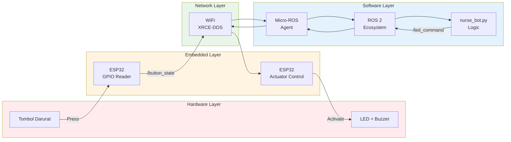

<h1 align="center">Smart Nurse Call System</h1>
<p align="center">
  <i>Project MK Robotika Medis</i>
</p>

| Nama | NIM |
|------|-----|
| Andronikus Parasian Siagian | 122430095 |
| M. Aulia Bahtiar | 122430062 |
| Saif Khan Nazirun |122430060 |

Smart Nurse Call System merupakan proyek Robotika Medis berbasis
mikrokontroler ESP32 dan Internet of Things (IoT) yang dirancang untuk
meningkatkan komunikasi antara pasien dan tenaga medis melalui sistem
panggilan otomatis yang responsif dan efisien.

---

## 📌 Pendahuluan
Dalam ekosistem rumah sakit modern (Smart Hospital), efisiensi dan kecepatan respons tenaga medis merupakan faktor vital dalam keselamatan pasien. Sistem pemanggilan perawat (Nurse Call System) konvensional umumnya masih berbasis analog (kabel) yang kaku, sulit dikembangkan, dan tidak terintegrasi dengan sistem data digital. 

Seiring dengan perkembangan teknologi Robotika Medis, diperlukan sistem yang lebih cerdas, fleksibel, dan berbasis data. Oleh karena itu, proyek ini mengembangkan prototipe sistem Nurse Call nirkabel yang memanfaatkan Robot Operating System 2 (ROS 2). Penggunaan ROS 2 memungkinkan sistem ini dikembangkan lebih lanjut menjadi robot asisten otonom di masa depan. 

Proyek ini berjudul "Smart Nurse Call System berbasis Micro-ROS". Sistem ini adalah implementasi sistem cerdas berbasis ROS 2 yang menghubungkan perangkat keras mikrokontroler (ESP32) dengan komputer pusat (Nurse Station) melalui jaringan WiFi. 

---

## 🎯 Tujuan Sistem
- Mengembangkan sistem pemanggil perawat berbasis ESP32
- Menerapkan konsep IoT pada sistem pelayanan kesehatan
- Meningkatkan kecepatan dan akurasi respon perawat
- Sebagai media pembelajaran implementatif Robotika Medis

---

## 🧠 Arsitektur Sistem
Sistem terdiri dari ESP32 sebagai pengendali utama yang menerima input dari
tombol pasien dan memberikan output berupa indikator LED dan buzzer. 
Sistem dapat dikembangkan ke jaringan IoT dan middleware robotik.

---

## 🛠️ Komponen yang Digunakan

### Perangkat Keras
- ESP32
- Push Button
- LED
- Buzzer
- Breadboard dan kabel jumper

### Perangkat Lunak
- Arduino IDE
- ROS2
- GitHub Pages
- HTML, CSS, JavaScript

---

## 🔧 Tahapan Pembuatan Sistem
### TAHAP 1: Instalasi Software (Environment Setup) 
Sistem operasi utama yang digunakan adalah Windows 11 dengan subsistem Linux (WSL 2) yang menjalankan Ubuntu 24.04. 

1.1. Instalasi WSL 2 (Ubuntu 24.04) 
- Buka PowerShell sebagai Administrator. 
- Jalankan perintah instalasi:
```
wsl --install -d Ubuntu-24.04
```
- Restart komputer jika diminta. 
- Buka aplikasi "Ubuntu" dari Start Menu, lalu buat username dan password UNIX baru. 

1.2. Instalasi ROS 2 Jazzy Jalisco 
- Masuk ke terminal Ubuntu, lalu jalankan perintah berikut baris per baris: 
- Set Locale: 
```
locale # Pastikan UTF-8
sudo apt update && sudo apt install locales 
sudo locale-gen en_US.UTF-8 
sudo update-locale LC_ALL=en_US.UTF-8 LANG=en_US.UTF-8 
export LANG=en_US.UTF-8
``` 
- Tambahkan Repository ROS 2: 
```
sudo apt install software-properties-common 
sudo add-apt-repository universe 
sudo apt update && sudo apt install curl -y 
sudo curl -sSL https://raw.githubusercontent.com/ros/rosdistro/master/ros.key -o /usr/share/keyrings/ros-archive-keyring.gpg 
echo "deb [arch=$(dpkg --print-architecture) signed-by=/usr/share/keyrings/ros-archive-keyring.gpg] http://packages.ros.org/ros2/ubuntu $(. /etc/os-release && echo $UBUNTU_CODENAME) main" | sudo tee /etc/apt/sources.list.d/ros2.list > /dev/null 
```
- Install Paket ROS 2 (Desktop): 
```
sudo apt update 
sudo apt upgrade 
sudo apt install ros-jazzy-desktop
```
- Setup Environment: Agar perintah ROS dikenali setiap terminal dibuka: 
```
echo "source /opt/ros/jazzy/setup.bash" >> ~/.bashrc 
source ~/.bashrc 
```

1.3. Instalasi Docker & Micro-ROS Agent 
Micro-ROS Agent dijalankan menggunakan Docker agar lebih stabil. 
- Install Docker di Windows: Unduh dan install Docker Desktop for Windows. 
- Pull Image Micro-ROS: Buka terminal Ubuntu, tarik image versi Jazzy: 
```
sudo docker pull microros/micro-ros-agent:jazzy 
```

### TAHAP 2: Konfigurasi Jaringan & Keamanan 
Tahap ini krusial agar ESP32 bisa berkomunikasi dengan Laptop melalui WiFi. 

2.1. Mengaktifkan WSL Mirrored Mode 
Agar IP Ubuntu sama dengan IP Windows (sehingga terbaca ESP32). 
- Di Windows, buka File Explorer. 
- Ketik %UserProfile% di address bar. 
- Buat file baru bernama .wslconfig (pastikan tidak ada ekstensi .txt). 
- Isi file dengan konfigurasi berikut: 
```
[wsl2] 
networkingMode=mirrored 
dnsTunneling=true 
firewall=true 
autoProxy=true 
```
- Restart WSL via PowerShell: wsl --shutdown. 

2.2. Membuka Firewall Windows 
Membuka Port 8888 (UDP) agar data ESP32 tidak diblokir. 
- Buka PowerShell (Run as Administrator). 
- Jalankan perintah: 
```
New-NetFirewallRule -DisplayName "MicroROS Agent" -Direction Inbound -LocalPort 8888 -Protocol UDP -Action Allow 
```
 
### TAHAP 3: Perakitan Hardware 
Merangkai komponen elektronik pada Breadboard. 

3.1 Alat dan Bahan (Komponen Sistem) 
Sistem ini terdiri dari perangkat keras (hardware) di sisi pasien dan perangkat lunak (software) di sisi server. 

A. Perangkat Keras (Hardware): 
- ESP32 DOIT DEVKIT V1: Mikrokontroler utama yang berfungsi sebagai pemroses data dan modul komunikasi WiFi. 
- Push Button (Tactile Switch): Sensor input manual untuk memicu sinyal darurat. 
- LED Merah (5mm): Indikator visual untuk status bahaya/panggilan aktif. 
- LED Hijau (5mm): Indikator visual untuk status aman/standby. 
- Resistor 330 Ohm (2 buah): Komponen penghambat arus listrik yang wajib dipasang pada kaki LED agar LED tidak kelebihan tegangan dan terbakar (putus). 
- Active Buzzer (5V): Aktuator suara untuk memberikan notifikasi alarm. 
- Breadboard & Kabel Jumper: Media perakitan rangkaian non-permanen. 
- Kabel Micro USB: Untuk catu daya dan unggah program. 
- Laptop: Sebagai Nurse Station (Server). 

B. Perangkat Lunak (Software): 
- Sistem Operasi: Windows 11 (Host) & Ubuntu 24.04 (WSL). 
- Robot Operating System: ROS 2 Jazzy Jalisco. 
- Middleware: Micro-ROS Agent (via Docker). 
- IDE: Arduino IDE (v2.x) & VS Code (Optional). 

3.2 Perancangan Perangkat Keras (Wiring) 

Perakitan dilakukan dengan menghubungkan komponen ke GPIO ESP32. Sangat penting untuk memasang Resistor 330 Ohm secara seri dengan LED. 

| Komponen | Kaki Komponen | Pin ESP32 | Keterangan Sambungan | 
|----------|---------------|-----------|----------------------|
| Push Button |Kaki 1 | GPIO 16 (RX2) | Mode INPUT_PULLUP |
| | Kaki 2 | GND | - | 
| LED Merah | Kaki Positif (Anoda) | GPIO 23 | - | 
| | Kaki Negatif (Katoda) | GND | Lewat Resistor 330Ω (Seri) | 
| LED Hijau | Kaki Positif (Anoda) | GPIO 22 | - | 
| | Kaki Negatif (Katoda) | GND | Lewat Resistor 330Ω (Seri) 
| Buzzer | Kaki Positif (+) | GPIO 25 | - |
| | Kaki Negatif (-) | GND | Langsung ke Ground |

### TAHAP 4: Pemrograman Firmware (ESP32) 
4.1. Setup Arduino IDE 
- Install Arduino IDE 2.0+. 
- Install Board ESP32: 
  - File -> Preferences -> Additional Board Manager URLs: https://raw.githubusercontent.com/espressif/arduino-esp32/gh-pages/package_esp32_index.json 
  - Tools -> Board -> Board Manager -> Cari "esp32" by Espressif Systems -> Install. 
- Install Library Micro-ROS: 
  - Download library .zip dari GitHub micro_ros_arduino.
  - Sketch -> Include Library -> Add .ZIP Library. 

4.2. Upload Kode Program 
- Salin kode lengkap (robotika_medis.ino) ke Arduino IDE. 
- PENTING: Edit bagian konfigurasi jaringan sesuai kondisi saat ini: 
```
char ssid[] = "NamaWiFiAnda"; 
char password[] = "PasswordWiFiAnda"; 
char agent_ip[] = "192.168.x.x"; // Cek pakai 'ip a' di Ubuntu 
```
- Hubungkan ESP32 via USB. 
- Pilih Board: DOIT ESP32 DEVKIT V1. 
- Klik Upload. 

### TAHAP 5: Pengujian Komunikasi Manual (CLI) 
Sebelum membuat program otomatis, pengujian manual dilakukan menggunakan Command Line Interface (CLI) ROS 2 untuk memastikan jalur data Input dan Output sudah terhubung dengan benar tanpa bug. 

5.1. Persiapan Terminal 
Buka terminal baru di Ubuntu (pastikan Agent Micro-ROS sudah berjalan di terminal lain). Masuk ke lingkungan ROS 2: 
```
sudo docker run -it --rm --net=host ros:jazzy 
```

5.2. Pengujian Input (Monitoring Tombol) 
Langkah ini bertujuan memverifikasi apakah data dari ESP32 masuk ke Laptop. 
- Jalankan perintah echo (mendengar): 
```
ros2 topic echo /button_state --no-daemon 
```
- Aksi: Tekan dan tahan tombol fisik di ESP32. 
- Hasil: Terminal menampilkan data: true. Saat dilepas, menampilkan data: false. 

5.3. Pengujian Output (Kendali Lampu) 
Langkah ini bertujuan memverifikasi apakah Laptop bisa memerintah ESP32. 
- Nyalakan Alarm (Simulasi Bahaya): 
```
ros2 topic pub --once /led_command std_msgs/msg/Bool "{data: true}" 
```
Hasil: LED Merah menyala dan Buzzer berbunyi. 
- Matikan Alarm (Simulasi Aman): 
```
ros2 topic pub --once /led_command std_msgs/msg/Bool "{data: false}" 
```
Hasil: LED Merah mati dan LED Hijau menyala. 

### TAHAP 6: Implementasi Logic Node (Otomatisasi Sistem) 
Setelah pengujian manual berhasil, tahap terakhir adalah membuat "Otak" (Node) menggunakan Python agar sistem dapat merespons secara otomatis tanpa perlu mengetik perintah manual. 
- Buka terminal Ubuntu dan buat file script Python: 
```
nano nurse_bot.py 
```
- Masukkan kode program berikut: 
```
import rclpy 
from rclpy.node import Node 
from std_msgs.msg import Bool 

class NurseBot(Node): 
    def __init__(self): 
        super().__init__('nurse_bot') 
        # Publisher: Mengirim perintah ke Lampu/Buzzer 
        self.publisher_ = self.create_publisher(Bool, '/led_command', 10) 
        # Subscriber: Menerima data dari Tombol 
        self.subscription = self.create_subscription(Bool, '/button_state', self.callback, 10) 
        self.get_logger().info("SISTEM NURSE CALL AKTIF... Menunggu Panggilan.") 

    def callback(self, msg): 
        # Logika Sederhana: Input = Output 
        # Jika Tombol True (Ditekan) -> Kirim Perintah True (Nyala) 
        cmd = Bool() 
        cmd.data = msg.data 
        self.publisher_.publish(cmd) 

        # Tampilkan Log 
        if msg.data: 
            self.get_logger().warn("🚨 DARURAT! Pasien Memanggil Bantuan!") 
        else: 
            self.get_logger().info("✅ AMAN. Tombol Dilepas.") 

def main(args=None): 
    rclpy.init(args=args) 
    node = NurseBot() 
    rclpy.spin(node) # Loop agar program tidak berhenti 
    rclpy.shutdown() 

if __name__ == '__main__': 
    main() 
```
- Simpan file (Ctrl+X, Y, Enter). 
- Jalankan sistem otomatisasi: 
```
python3 nurse_bot.py 
```
Hasil: Sekarang saat tombol ditekan, alarm akan menyala secara otomatis. 

 ### TAHAP 7: Uji Coba Keseluruhan (Running System) 
Berikut adalah urutan menyalakan sistem agar berhasil: 
- Jalankan Agent (Di Terminal 1): 
```
sudo docker run -it --rm --net=host microros/micro-ros-agent:jazzy udp4 --port 8888 -v6 
```
- Nyalakan ESP32: Tekan tombol RESET (EN) di ESP32. Pastikan di Terminal 1 muncul: Session established.
- Jalankan Otak/Bot (Di Terminal 2): 
```
python3 nurse_bot.py 
```
- Demonstrasi: 
  - Tekan Tombol Fisik -> Lampu Merah Nyala & Terminal Laptop muncul peringatan "DARURAT".
  - Lepas Tombol -> Lampu Hijau Nyala.

---

## 📌 4. Catatan Kendala dan Penyelesaian Masalah
Selama proses pengembangan Sistem Nurse Call berbasis Micro-ROS, tim menghadapi berbagai kendala teknis yang berkaitan dengan kompilasi firmware, konfigurasi jaringan, serta integrasi Micro-ROS dengan ROS 2 Agent. Kendala-kendala ini umumnya muncul akibat perbedaan lingkungan sistem, keterbatasan image Docker, serta pengaturan keamanan jaringan pada sistem operasi host. Berikut adalah rincian kendala yang terjadi beserta analisis penyebab dan solusi yang diterapkan: 
| No | Jenis Kendala | Deskripsi & Penyebab Masalah | Solusi (Troubleshooting) |
|----|---------------|-----------------------------|---------------------------|
| 1 | Error Kompilasi Arduino | Pesan error: `invalid conversion from 'const char*' to 'char*'`. Penyebabnya adalah ketidakcocokan tipe data pada library `micro_ros_arduino`, di mana konfigurasi jaringan membutuhkan tipe `char*`, sementara SSID dan password dideklarasikan sebagai `const char*`. | Mengubah deklarasi variabel SSID dan password menjadi array karakter yang dapat dimodifikasi. Contoh: `char ssid[] = "nama_wifi";` |
| 2 | Koneksi Gagal (Session) | ESP32 tidak dapat terhubung ke Micro-ROS Agent, ditandai dengan tidak munculnya log *Session Established*. Hal ini disebabkan oleh penggunaan WSL 2 dengan IP NAT (172.x.x.x) yang tidak dapat diakses oleh ESP32 pada jaringan WiFi lokal (192.168.x.x). | Mengubah mode jaringan WSL menjadi **Mirrored Mode** dengan membuat file `.wslconfig`, sehingga IP Address Ubuntu sama dengan IP Address Windows dan dapat diakses oleh ESP32. |
| 3 | Firewall Blocking | IP Address sudah benar, namun data tetap tidak diterima oleh Agent. Penyebabnya adalah Windows Firewall memblokir koneksi masuk (Inbound) pada port UDP 8888 yang digunakan oleh Micro-ROS. | Membuat aturan baru (*New Inbound Rule*) pada Windows Firewall menggunakan PowerShell untuk mengizinkan koneksi UDP pada port 8888. |
| 4 | ROS 2 Daemon Timeout | Muncul pesan error: `TimeoutError: [Errno 110] Connection timed out` saat menjalankan perintah `ros2 topic echo`. Penyebabnya adalah kegagalan komunikasi ROS 2 Daemon akibat perubahan konfigurasi jaringan atau isolasi container Docker. | Menjalankan perintah ROS 2 CLI dengan argumen `--no-daemon` atau melakukan restart total container Docker untuk memulihkan komunikasi. |
| 5 | Missing Executable | Pesan error: `ros2: command not found` saat mencoba menjalankan perintah ROS 2 CLI di dalam container Micro-ROS Agent. Penyebabnya adalah image `microros/micro-ros-agent` bersifat minimalis dan tidak menyertakan paket ROS 2 lengkap. | Menjalankan container terpisah menggunakan image `ros:jazzy` dengan konfigurasi jaringan yang sama (`--net=host`) khusus untuk debugging dan eksekusi perintah ROS 2 CLI. |

4.2 Evaluasi Sistem 
Meskipun terdapat kendala-kendala di atas, sistem akhirnya berhasil berjalan stabil setelah semua solusi diterapkan. Beberapa poin evaluasi dari pengerjaan proyek ini adalah: 
- Pentingnya Konfigurasi Jaringan: Dalam proyek IoT yang melibatkan subsistem (seperti WSL) dan Docker, pemahaman tentang IP Routing dan Firewall sangat krusial. Mode jaringan host atau mirrored terbukti menjadi solusi paling efektif. 
- Keandalan Micro-ROS: Setelah koneksi terbentuk, protokol XRCE-DDS terbukti sangat andal. Data dari tombol dikirim secara real-time dengan latensi yang hampir tidak terasa, memenuhi standar kebutuhan sistem medis sederhana. 
- Fleksibilitas ROS 2: Penggunaan Node Python memudahkan pembuatan logika otomatisasi ("Otak Sistem") dibandingkan harus memprogram logika kompleks langsung di dalam mikrokontroler.

---

## 📷 Dokumentasi Proyek
[🖼️ Klik untuk melihat dokumentasi](https://andronikus122430095-glitch.github.io/RobotikaMedis.github.io/WhatsApp%20Image%202025-12-07%20at%2018.34.56.jpeg)

## 🎥 Video Demonstrasi Sistem
[▶️ Klik untuk melihat video demonstrasi](https://andronikus122430095-glitch.github.io/RobotikaMedis.github.io/WhatsApp%20Video%202025-12-07%20at%2018.32.37.mp4)

# 🧠 Arsitektur Sistem - Diagram Blok

## Alur Kerja Sistem

```mermaid
flowchart TD
    A[📋 Input Pasien<br/>Tombol Darurat Fisik] --> B[⚙️ Processing ESP32<br/>Baca Status GPIO]
    B --> C[📤 Publish ke Topic<br/>/button_state]
    C --> D[🌐 Network Transport<br/>WiFi - Protokol XRCE-DDS]
    D --> E[🤖 ROS 2 Agent<br/>Micro-ROS Agent]
    E --> F[🐍 Logic Processing<br/>Python Node: nurse_bot.py]
    F --> G[📥 Proses Logika<br/>& Publish ke /led_command]
    G --> H[🌐 Network Transport<br/>WiFi - Protokol XRCE-DDS]
    H --> I[📡 ESP32 Subscribe<br/>Topic: /led_command]
    I --> J[💡 Actuator Response<br/>Aktivasi LED + Buzzer]
    
    style A fill:#e1f5ff
    style B fill:#fff4e1
    style C fill:#fff4e1
    style D fill:#e8f5e9
    style E fill:#f3e5f5
    style F fill:#fff3e0
    style G fill:#fff3e0
    style H fill:#e8f5e9
    style I fill:#fff4e1
    style J fill:#ffebee
```



## Komponen Sistem

### 1️⃣ **Input Pasien**
- Pasien menekan tombol darurat fisik
- Trigger awal sistem

### 2️⃣ **Processing ESP32**
- ESP32 membaca status GPIO
- Publikasi data ke topic `/button_state`

### 3️⃣ **Network Transport**
- Data dikirim via WiFi
- Menggunakan protokol XRCE-DDS

### 4️⃣ **ROS 2 Agent**
- Micro-ROS Agent menerima data
- Meneruskan data ke ROS 2 ecosystem

### 5️⃣ **Logic Processing**
- Python node (`nurse_bot.py`) memproses logika
- Mem-publish perintah ke `/led_command`

### 6️⃣ **Actuator Response**
- ESP32 subscribe ke topic `/led_command`
- Mengaktifkan LED + Buzzer

---

## Diagram Arsitektur Alternatif



---

## Flow Diagram Sederhana

```mermaid
sequenceDiagram
    participant P as 👤 Pasien
    participant E1 as ESP32 (Input)
    participant N as 🌐 Network (XRCE-DDS)
    participant R as 🤖 ROS 2 Agent
    participant L as 🐍 nurse_bot.py
    participant E2 as ESP32 (Output)
    participant A as 💡 LED + Buzzer
    
    P->>E1: Tekan Tombol Darurat
    E1->>E1: Baca Status GPIO
    E1->>N: Publish /button_state
    N->>R: Forward Data
    R->>L: Kirim Status
    L->>L: Proses Logika
    L->>R: Publish /led_command
    R->>N: Forward Command
    N->>E2: Subscribe /led_command
    E2->>A: Aktivasi LED + Buzzer
    A-->>P: Alert Visual & Audio
```



---

## Teknologi yang Digunakan

| Komponen | Teknologi |
|----------|-----------|
| **Hardware** | ESP32, LED, Buzzer, Push Button |
| **Protokol** | XRCE-DDS (eXtremely Resource Constrained Environments - DDS) |
| **Framework** | ROS 2, Micro-ROS |
| **Network** | WiFi |
| **Programming** | Python (nurse_bot.py), C++ (ESP32) |
| **Messaging** | DDS Topics (`/button_state`, `/led_command`) |

---

## Keunggulan Sistem

✅ **Real-time Communication** - Menggunakan DDS untuk komunikasi real-time  
✅ **Scalable** - Mudah menambah sensor/aktuator baru  
✅ **Distributed** - Komponen dapat berada di lokasi berbeda  
✅ **Reliable** - ROS 2 menyediakan QoS (Quality of Service)  
✅ **Flexible** - Logic processing dapat dimodifikasi tanpa mengubah hardware  

